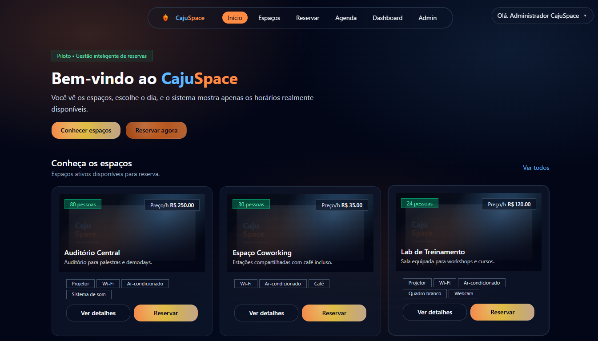
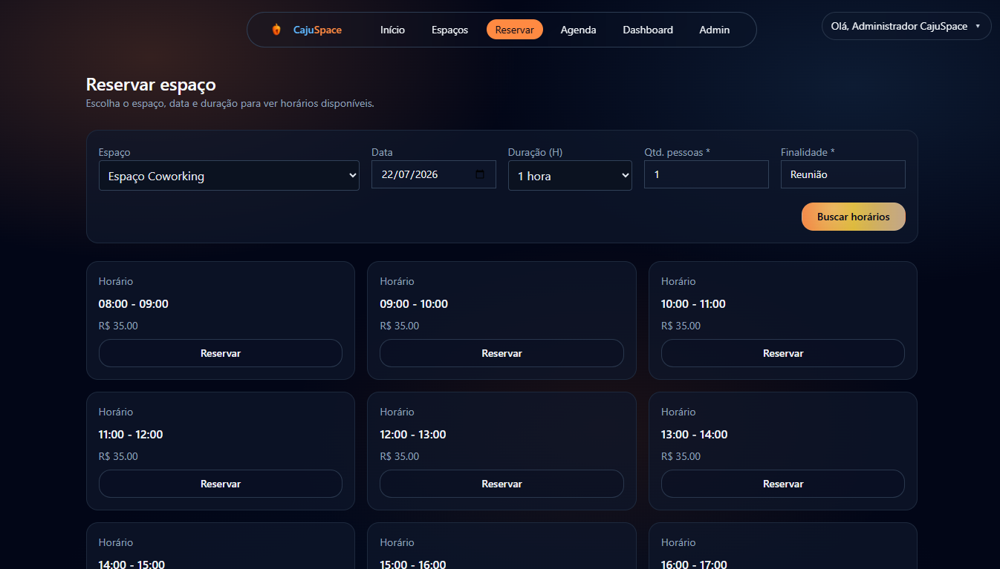
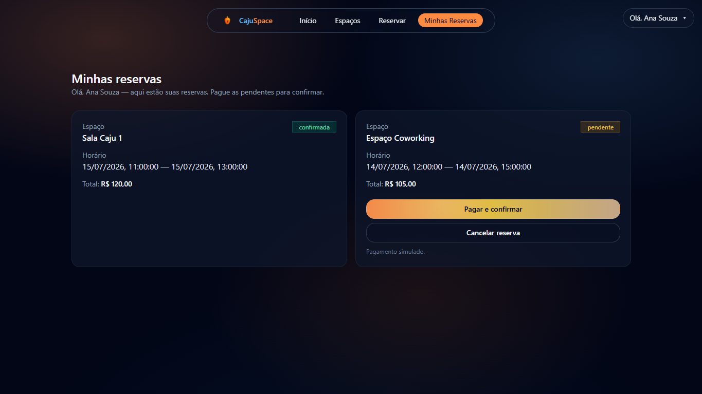
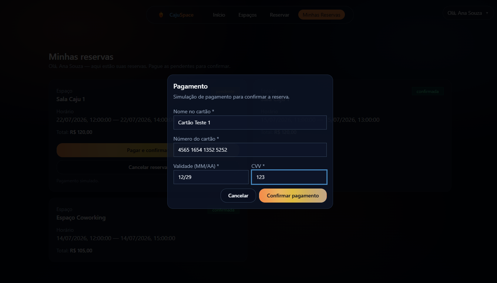
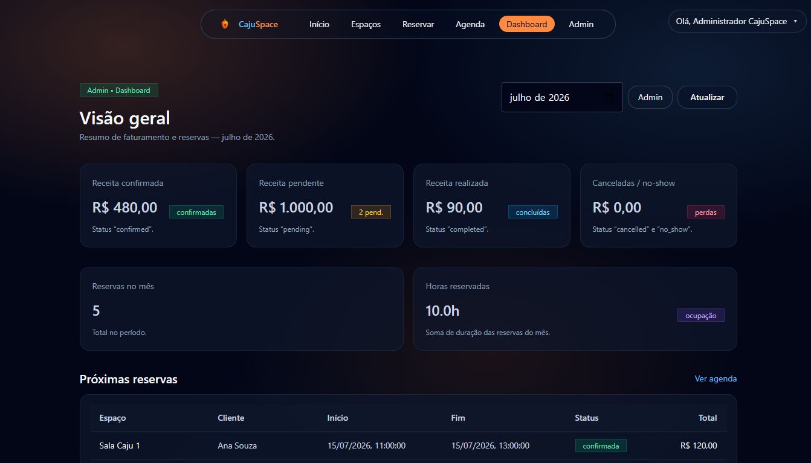
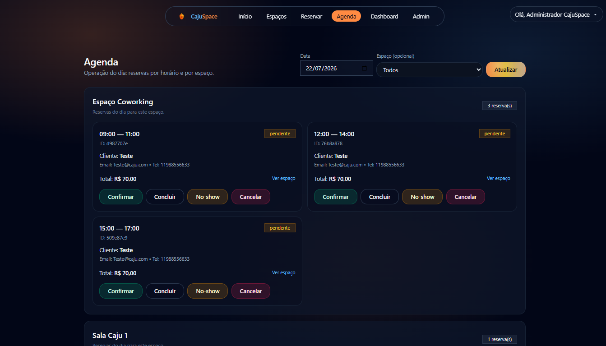
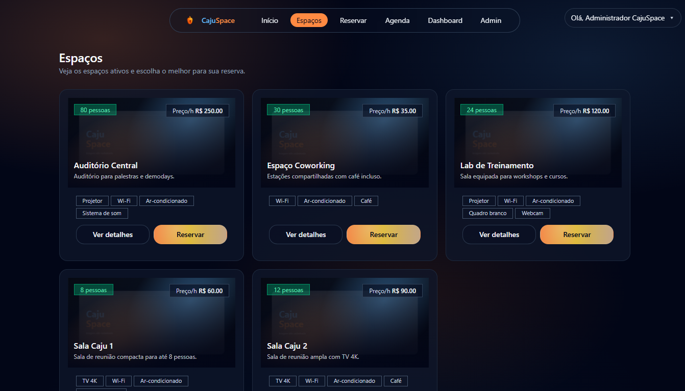
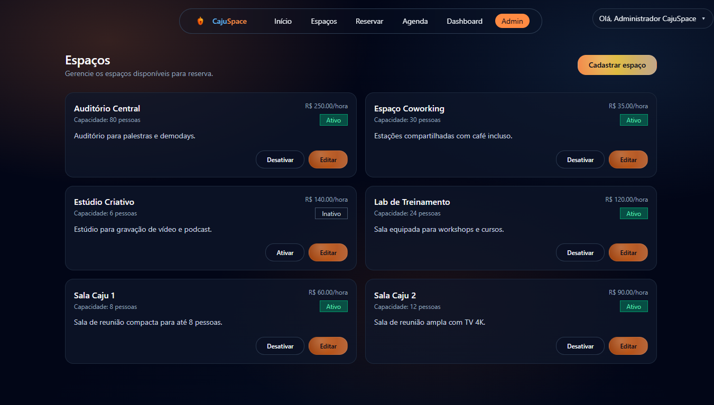
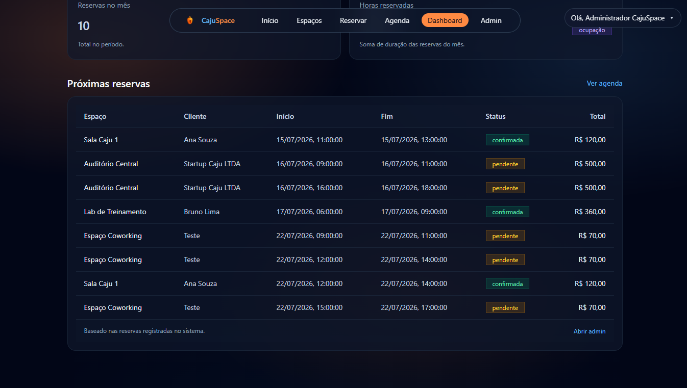
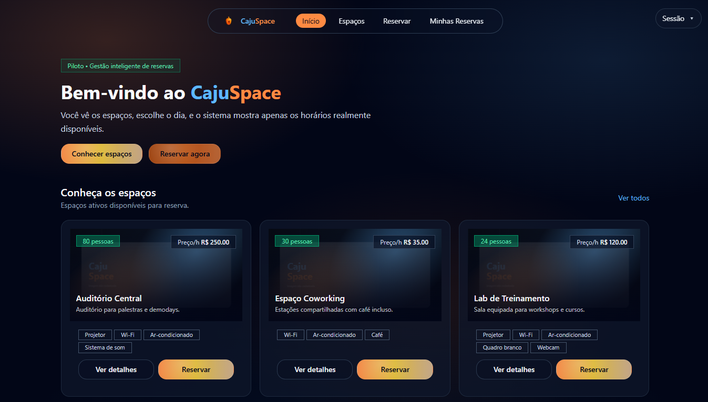

# 🏢 CajuSpace — Gestão e Locação Inteligente de Espaços

**Reserva inteligente de espaços para eventos** — o sistema mostra automaticamente **apenas os horários livres**, previne conflitos de agenda e separa perfis de cliente e equipe/admin.

🔗 **[App ao vivo](https://cajuspace.vercel.app)** · 📄 **[Guia de setup](SETUP.md)**

---

## 📸 Demonstração

| Início — o sistema mostra só os horários livres | Reserva com horários disponíveis |
|:---:|:---:|
|  |  |
| **Minhas reservas (cliente)** | **Pagamento simulado** |
|  |  |
| **Dashboard gerencial (KPIs)** | **Agenda de ocupação** |
|  |  |

Mais telas — espaços, administração e visão do cliente

| Listagem de espaços | Admin — gestão de espaços |
|:---:|:---:|
|  |  |
| **Reservas no dashboard** | **Início (visão do cliente)** |
|  |  |

---

# Sistema de Gerenciamento de Locação de Espaços – CajuSpace

**Projeto desenvolvido para o Desafio de Programação do Programa Jovem Tech (Edital nº 001/2025)**  
Sistema web para gerenciamento e locação de espaços para eventos, inspirado em ambientes de inovação como o CAJUHUB.

## Índice

1. [Visão Geral do Projeto](#1-visão-geral-do-projeto)
2. [Escopo do Desafio Atendido](#2-escopo-do-desafio-atendido-conforme-edital)
3. [Funcionalidades Implementadas](#3-funcionalidades-implementadas)
4. [Fluxos do Sistema](#4-fluxos-do-sistema)
5. [Regras de Negócio](#5-regras-de-negócio)
6. [Tecnologias Utilizadas](#6-tecnologias-utilizadas)
7. [Execução do Sistema](#7-execução-do-sistema-conforme-critério-55)
8. [Instruções de Uso](#8-instruções-de-uso)
9. [Qualidade, Organização e Performance](#9-qualidade-organização-e-performance)
10. [Considerações Finais](#10-considerações-finais)

---

## 1. Visão Geral do Projeto

- O CajuSpace é um sistema de locação de espaços construído com Next.js (App Router), React e Tailwind CSS, utilizando Supabase como backend para persistência de dados e autenticação.
- O aplicativo foi concebido para permitir que clientes visualizem espaços, filtrem por disponibilidade de data e horário, façam reservas e acompanhem seu histórico. Ao mesmo tempo, a equipe administrativa pode cadastrar e editar espaços, configurar tipos e recursos, consultar agendas de ocupação e intervir em reservas quando necessário.
- O fluxo principal para o usuário final consiste em navegar até a listagem de espaços, escolher um local, selecionar uma data e duração e, a partir disso, visualizar todos os horários disponíveis em que o espaço não está ocupado. A interface fornece feedback em tempo real, previne conflitos de agenda e facilita o cancelamento ou confirmação de reservas com um simples clique.
- O fluxo principal que toca o core do projeto, o sistema de verificação de conflitos, foi pensado para o melhor UX, nós projetos tradicionais o usuário tem que selecionar e testar várias vezes até "adivinhar" qual é o horário e dia disponível para que ele possa reservar/alugar o espaço. 
- O CajuSpace foi pensando como um Sistema de Reserva de Espaços Inteligente, trazendo automaticamente os espaços disponíveis e servindo ao cliente/usuário.

---

## 2. Escopo do Desafio Atendido (Conforme Edital)

Esta solução contempla integralmente os requisitos mínimos descritos no item **5.4.3** do edital:

### a) Cadastro e listagem de espaços disponíveis para locação (back-end)
- Na rota `app/api/espacos` permite criar, listar, editar e desativar (delete lógico) espaços. O repositório em `app/lib/repository/spaces.repository.ts` centraliza o acesso á tabela ``spaces` do Supabase, incluindo a sincronização de recursos associados e o filtro por status ativo.

### b) Cadastro de usuários/clientes (back-end)
- **Cadastro e autenticação de clientes:** As rotas `app/api/auth/client-register` e `app/api/auth/client-login` recebem dados do usuário (nome, e‑mail, telefone e CPF/CNPJ) e criam registros na tabela clients, retornando um cookie de sessão, e em alguns fluxos logando diretamente o usuário.

- **Cadastro e autenticação de equipe:** A rota `app/api/auth/login` permite que membros da equipe façam login via **e‑mail e PIN,** diferenciando claramente os perfis de acesso (cliente vs. staff/admin).

### c) Registro de reservas de espaços, com verificação de conflitos de horários
- A rota `app/api/reservations` recebe requisições de reserva contendo o espaço, data/hora inicial e final, finalidade do uso e número de pessoas.

- No front‑end, a página de reserva `/reservar` consulta a disponibilidade através de `app/api/availability`, que calcula horários livres com base no horário de funcionamento e em reservas já existentes, evitando sobreposições. O código em `app/api/availability/route.ts` demonstra a verificação de conflitos, utilizando os registros das tabelas `reservations` e `blackout_periods` para retornar apenas intervalos disponíveis.

### d) Visualização da agenda de ocupação dos espaços
- A rota `app/api/agenda` expõe uma visão consolidada das reservas por espaço, permitindo visualizar horários ocupados.

- No Front, a página `/agenda` consome essa rota e exibe uma grade de com ocupações, facilitando a compreensão de períodos livres e ocupados.

- Feature implementada pensando em descrever visualmente de forma simples e direta, todos registros de reservas filtrados por data.

### e) Interface gráfica (front-end) com navegação intuitiva
- A aplicação Utiliza `TailwindCSS` e componentes reutilizáveis e padronizados, encontrados em `app/components/ui` componentes como (Botões, Cards, Badges, Modais) para entregar uma experiência padronizadamente agradável e responsiva. 

- A navegação principal está centralizada no cabeçalho intuitivo flutuante em `app/components/navigation/Header.tsx`, com rotas claras para _"Espaços"_, _"Reservar"_, _"Minhas Reservas"_ e área administrativa quando logado como administrador do sistema, o `Header.tsx` guarda a lógica de roteamento de perfil, quando logado como `Admin` disponibiliza no Header funcionalidades diferentes do que como `Client` e `Staff`

- Feedback visual é fornecido via Toast também encontrado nos `app/components/ui`, visando UX clara e intuitiva.

---

## 3. Funcionalidades Implementadas

### Funcionalidades Essenciais
- Cadastro e gerenciamento de espaços
- Cadastro e autenticação de usuários 
- Criação de reservas com validação de conflitos
- Consulta de disponibilidade por data e duração
- Visualização de reservas realizadas 

### Funcionalidades Adicionais / Inovação

- Pagamento simulado: ao reservar um espaço, o cliente recebe um fluxo de pagamento fictício; a reserva só é confirmada após essa etapa.
- Cancelamento com motivo: clientes podem cancelar uma reserva escolhendo motivos pré‑definidos ou descrevendo a razão; o registro é salvo para análise futura.
- Diferença de perfis: controle de permissões entre clientes (que só gerenciam suas reservas) e equipe (que pode intervir ou reservar em nome de clientes).
- Feedback imediato: uso de toasts e modais para informar sucesso ou erros nas ações do usuário.
- Dashboard: Voltado para `Equipe/Admin` temos um Dashboard focado na área financeira do sistema, com KPIs que explicam de forma visual e direta os resultados financeiros filtrados por mês. 
- Área do cliente: página “Minhas Reservas” com listagem, cancelamento (com motivo) e confirmação de pagamento simulado.

---

## 4. Fluxos do Sistema

### Fluxo do Cliente

1. Explorar espaços – Navega até `/espacos` ou usa o destaque na página inicial para conhecer os ambientes disponíveis.

2. Filtrar por data e duração – Em `/reservar`, escolhe o espaço, data, duração, número de pessoas e finalidade do uso, clica em _(buscar horários)_ a aplicação retorna somente horários realmente livres. _(depois de filtrá-los no sistema como explicado mais acima)_ 

3. Realizar reserva – Após filtragem e disposição dos horários disponíveis para o usuário, escolhe e seleciona _Reservar_, aqui pode ramificar para 2 outros fluxos. 

    1. - **Se logado** - Reserva direto e passa para _Minhas Reservas_ com indicação do que fazer. _(confirmar com o pagamento da reserva)_

    2. - **Se NÃO logado** - Abre modal para solicitar o login ou cadastro no sistema, depois dessa etapa o sistema não perde o estado e seleção de reserva anteriormente feita, e inicia a sessão do usuário no sistema e faz a reserva, redirecionando para _Minhas Reservas_ para efetuar o pagamento/cancelar e finalizar o fluxo.

4. Confirmar pagamento – Um modal de pagamento simulado coleta dados fictícios (nome, número do cartão, validade e CVV) e, ao confirmar, altera a reserva para "confirmada”.

5. Acompanhar reservas – A seção “Minhas Reservas” exibe todas as reservas do usuário, com status, detalhes do espaço e possibilidade de cancelamento.

### Fluxo Administrativo / Equipe
1. Login – Integrantes da equipe acessam o sistema via `/login` usando E‑mail e PIN.

2. Gerenciar espaços e tipos – No módulo administrativo(Admin) `(/admin/espacos e /admin/espacos/space-types)`, criam e editam espaços, preços e recursos.

3. Acompanhar agenda – A página `/agenda` apresenta a ocupação por espaço e permite identificar períodos disponíveis ou bloqueados.

4. Operar reservas – A equipe pode reservar em nome do cliente via `/reservar`, selecionando um cliente existente ou cadastrando um novo diretamente no modal _(mesmo fluxo bifurcado do cliente, citado anteriormente)_ 

5. Dashboard – A rota `/dashboard` exibe informações consolidadas (reservas por status, ocupação, faturamento estimado) para acompanhamento gerencial e financeiro.

---

## 5. Regras de Negócio

- **Prevenção de conflitos** – Uma nova reserva só é aceita se o intervalo solicitado não colidir com reservas existentes (status pendente ou confirmada) ou com períodos de bloqueio (blackout_periods), e esteja dentro do horário de funcionamento do local

- **Status das reservas** – Após criação, reservas ficam “pendentes” até pagamento, com o pagamento são marcadas como “confirmadas”, podem ser canceladas a qualquer momento, registrando motivo e horário de cancelamento _(cancelamento pode ser feito por admin e pelo cliente)_

- **Validação de dados** – Documentos (CPF/CNPJ) e telefones são sanitizados e validados, campos obrigatórios como nome e finalidade de uso precisam ser preenchidos, são obrigatório para prosseguir o fluxo.

- **Horário de funcionamento** – Cada espaço possui horário padrão de funcionamento (herdado das configurações globais, _das 8h da manhã ás 22h da noite_), a disponibilidade só considera intervalos dentro desses horários.

- **Controle de perfis** – Clientes acessam apenas suas próprias reservas, equipe acessa todos os dados de reservas e pode realizar reservas para clientes.

---

## 6. Tecnologias Utilizadas

- Next.js 16 (App Router) – estrutura de rotas e server components, mesclando páginas estáticas e dinâmicas.
- React 19 – base para a construção da interface.
- TypeScript – tipagem estática para maior confiabilidade do código.
- Tailwind CSS 4 – estilização utilitária, proporcionando design responsivo e consistente.
- Supabase – banco de dados PostgreSQL gerenciado com integração em tempo real, utilizado para armazenar espaços, reservas, clientes, recursos e horários de funcionamento.
- @supabase/supabase-js v2 – SDK para interação com o banco e autenticação.
- Vercel – hospedagem do front‑end (Next.js) e APIs serverless (rotas em app/api).

---

## 7. Execução do Sistema (Conforme Critério 5.5)

O sistema encontra-se publicado em ambiente de produção e pode ser acessado diretamente via navegador web.

**URL do sistema em produção:** https://cajuspace.vercel.app

Não é necessária instalação local para execução.

---

## 8. Instruções de Uso

- **Explorar espaços** – acesse a página inicial `/` ou na página `/espacos` para visualizar todos os ambientes cadastrados, clique em cada card para ver detalhes como os recursos que aquele espaço contém e a visualização melhor da imagem.

- **Realizar reserva** – navegue até a página `/reservar`, selecione espaço, data, duração, informe a finalidade e a quantidade de pessoas e clique em “Buscar horários”, escolha um horário livre, e finalize.

- **Confirmar pagamento** – para reservas pendentes, abra a seção “Minhas Reservas” _(como cliente)_, clique em “Pagar e confirmar” e conclua a simulação de pagamento, a reserva passa para o status “confirmada”.

- **Cancelar reserva** – em “Minhas Reservas”, clique em “Cancelar reserva”, escolha um motivo ou descreva em outro, a reserva é removida da agenda e guardada com o motivo.

- **Acessar área administrativa** – membros da equipe fazem login via `/login`, navegam até `/admin/espacos` para gerenciar espaços, vão até `/agenda` para ver a ocupação e `/dashboard` para visualizar dashboard gerencial.

- **Visualizar dashboard** – a rota `/dashboard` apresenta métricas consolidadas (reservas por status, ocupação etc.) para análise rápida.

---

## 9. Qualidade, Organização e Performance

- **Estrutura modular** – O código está organizado em pastas como components, lib, api e app, favorecendo a reutilização e manutenção. Repositórios centralizam chamadas ao Supabase, enquanto componentes de UI isolam elementos visuais.

- **Performance otimizada** –  Páginas que não dependem de sessão são pré‑renderizadas; páginas dinâmicas usam Suspense e dynamic = "force-dynamic" para evitar erros de CSR. Testes com Lighthouse obtiveram notas altas em desempenho, acessibilidade e SEO.

> Por sentir uma lentidão em dev após build local fiz uma avaliação de desempenho no lighthouse, opção do navegador chorme para obter métricas de performance, acessibilidade e SEO, recebendo notas entre 90 e 100 para a maioria das telas.

- **Acessibilidade** – Labels são associados aos inputs, componentes têm contraste adequado.

- **Experiência do usuário** – Utilização de modais, toasts e estados de carregamento para orientar ações, layouts responsivos também foram um foco.

---

## 10. Considerações Finais

O sistema foi desenvolvido visando atender integralmente aos requisitos do desafio proposto no edital, com isso apresentando uma solução funcional, organizada e preparada para evolução futura, alinhada às boas práticas de desenvolvimento web e mercado competitivo.
